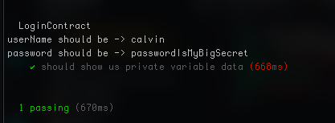

# TL;DR：

結論を言っておきますと、秘密をオンチェーンに乗せるな。private という修飾子も秘密を保持するのに、意味をなさない。

# 勘違いしていませんか

solidity に触ると、private という修飾子にであうことがあるかと思うんですが、それは時にはプライベートという修飾子をつけてあるので、より秘密性を持っている変数でパスワードとかを保存すればよくね？と勘違いをすると思います。結論からいうと、ブロックチェーンというものは全くと言っていいくらいプライバシーがありませんので、秘密をオンチェーンに保存するのは論外だということです。

# プライベートな変数を呼び出してみる

さて、実演を伴って行きたいので、コードを実際に動かしてみて行きましょうか。


今回の使うレポジトリは[こちら](https://github.com/thurendous/private-var)です。

レポジトリの結果を見たい方はこのようにしましょう。

```
git clone https://github.com/thurendous/private-var
yarn install
yarn hardhat test
```

これで以下のような結果になります。



今回使ったディレクトリーは`test`と`contracts`のみです。

その詳細を説明します。

今回はこんなコントラクトを作ってみました。
中身は至ってシンプルです。

-   `LoginContract`というコントラクトを宣言
-   private な変数の userName, password を作りました。
    この２つの変数をコンストラクタで初期化しています。

```sol
// SPDX-License-Identifier: UNLICENSED
pragma solidity ^0.8.9;

// Uncomment this line to use console.log
// import "hardhat/console.sol";

contract LoginContract {
    bytes32 private userName;
    bytes32 private password;

    constructor(bytes32 _username, bytes32 _password) {
        userName = _username;
        password = _password;
    }
}
```

コントラクトのストレージの単位は `slot` と言われます。このスロットを実は何らかの方法で読み取ることができるのです。

続いて、`test`フォルダを見てください。

以下のコードが描かれていると思います。

-   テストのフォルダは書いたコントラクトのテストをするためのフォルダ

今回はテストをするというか、ストレージのスロットを読み取ることにします。

```javascript
const {
    time,
    loadFixture,
} = require('@nomicfoundation/hardhat-network-helpers')
const { anyValue } = require('@nomicfoundation/hardhat-chai-matchers/withArgs')
const { expect } = require('chai')
const { ethers } = require('hardhat')

describe('LoginContract', function () {
    // this is the test we run to reveal the private variable
    it('should show us private variable data', async function () {
        const LoginContract = await ethers.getContractFactory('LoginContract')

        const userName = ethers.utils.formatBytes32String('calvin')
        const password = ethers.utils.formatBytes32String(
            'passwordIsMyBigSecret'
        )

        const loginContract = await LoginContract.deploy(userName, password)

        await loginContract.deployed() // wait for it to be deployed

        const slot0 = await ethers.provider.getStorageAt(
            loginContract.address,
            0
        )
        const slot1 = await ethers.provider.getStorageAt(
            loginContract.address,
            1
        )
        const formatUsername = await ethers.utils.parseBytes32String(slot0)
        const formatPassword = await ethers.utils.parseBytes32String(slot1)

        console.log('userName should be ->', formatUsername)
        console.log('password should be ->', formatPassword)
    })
})
```

結構たくさん書かれていますが、少しずつご説明します。

テストの大きな単位、「LoginContract というテストをするよ」ということを意味します。

```javascript
describe('LoginContract', function () {

}
```

テストのより小さな単位、文字列の部分は自由に記載して OK。自分が書いたのは「プライベートな値を出してくれるよ」ということを意味する

```javascript
 it('should show us private variable data', async function () {

}
```

コントラクトのクラスを作成します。

```javascript
const LoginContract = await ethers.getContractFactory('LoginContract')
```

`sername`, `password` を作成しておきます。

```javascript
const userName = ethers.utils.formatBytes32String('calvin')
const password = ethers.utils.formatBytes32String('passwordIsMyBigSecret')
```

コントラクトをインスタンス化します。そのときに、コントラクトのコンストラクタに入っている引数、先程作った `username`, `password` も代入します。

```javascript
const loginContract = await LoginContract.deploy(userName, password)
```

コントラクトのデプロイを待ちます。

```javascript
await loginContract.deployed() // wait for it to be deployed
```

続いて、肝心なところです。コントラクトのスロットを読み取ります。ポジションはそれぞれ 0, 1 です。これは`userName`, `password`のポジションと同じです。

```javascript
const slot0 = await ethers.provider.getStorageAt(loginContract.address, 0)
const slot1 = await ethers.provider.getStorageAt(loginContract.address, 1)
```

読み取った値を整形します。

```javascript
const formatUsername = await ethers.utils.parseBytes32String(slot0)
const formatPassword = await ethers.utils.parseBytes32String(slot1)
```

ターミナルへ表示させます。

```javascript
console.log('userName should be ->', formatUsername)
console.log('password should be ->', formatPassword)
```

これで先程の結果の画面が表示されて、読み取られていることがわかりますね。

```shell
  LoginContract
userName should be -> calvin
password should be -> passwordIsMyBigSecret
    ✔ should show us private variable data (668ms)


  1 passing (670ms)
```

だから、private な変数だったとしても、秘密なことは何一つねえよ。

**THE END**
