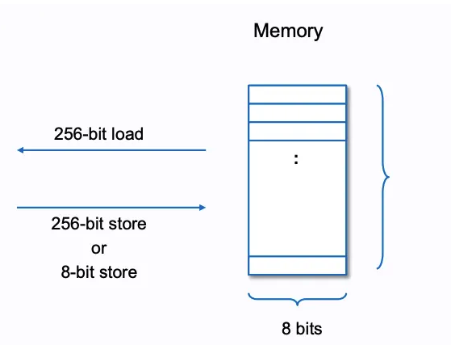
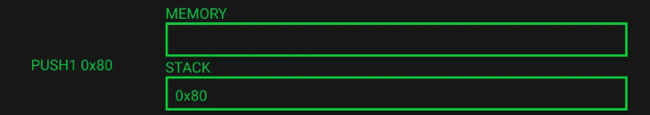
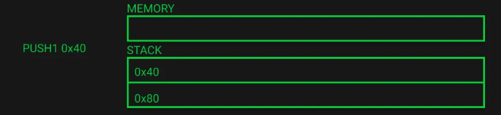
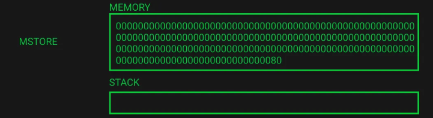
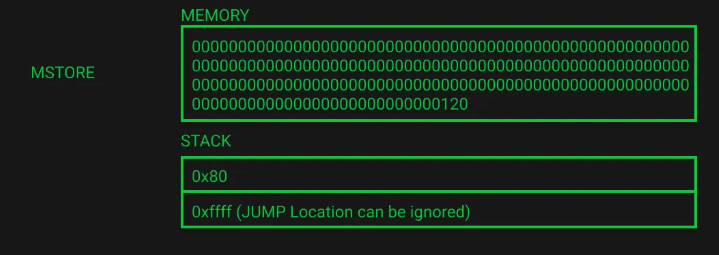
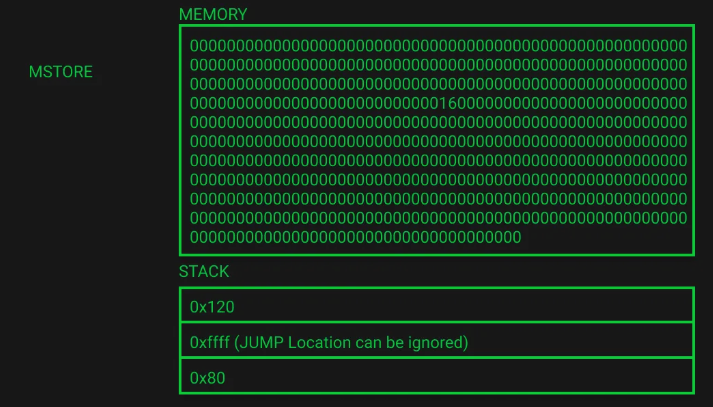
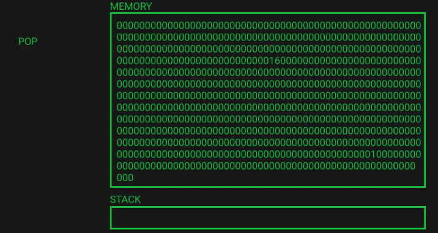

Hello, everybody!

# Never Give Up

以前書いた時から、EVM について理解できてきているので、当時は読みづらかった技術系の文章もすらすら読めるようになりました。そこで EVM のことあるいは他のなにかで頑張っているあなたももしかして何かができずに悩んでいるのかもしれません。

ここで行っておきますが、僕もそうだったので、安心してください。そのうち理解できるようになるだろう。

ちなみに、こちらの画像をみてごらん。

本当に経験した人しかわからないと思いますし、経験したとしてももう一度経験すると、やはり信じられない気持ちになると思うよね。

何がどうなっても、続けることが一番大切。

-   遅くてもいい


-   理想と現実


-   「続けてても意味ない」


-   最初の第一歩が一番むずいけどね


-   三日坊主 VS 続ける


---

今回は、メモリーについて説明する。

Part 1 では、EVM がどのようにバイトコードのどこを狙って run させるかを見てきた。 それは、外部の calldata を入力してきてコントラクトのどの関数を呼んでいるかを判別して run すべきバイトコードの箇所を決めていることがわかった。

これを理解することで、関数の署名・call stack・calldata・EVM のオペコード について理解が進んだと思う。

Part 2 では、EVM におけるメモリーについて色々見ていこう。

# Memory

Part1 のコードを思いだしてみて。`1_Storage.sol`というコントラクトがあった。

```sol
pragma solidity >=0.7.0 <0.9.0;

contract Storage {
	uint256 number;

	function store(uint256 num) public {
		number = num;
	}

	function retrieve() public view returns (uint256) {
		return number;
	}
}
```

これのバイトコードを生成すると、こうなっている。

```
608060405234801561001057600080fd....
```

今回はこの部分にフォーカスして説明したいと思う。一番最初の 5bytes だ。

```
6080604052
```

```
60 80                       =   PUSH1 0x80
60 40                       =   PUSH1 0x40
52                          =   MSTORE
```

これが聞いたことあるがかもしれないけど、いわゆる「free memory pointer」だ。

これを理解するには、まずはコントラクトのメモリーを理解しなければならない。

# メモリのデータ構造

コントラクトのメモリはシンプルにいうと、byte の array だ。32bytes(256bit)あるいは 1byte(8bit)の単位として保存される。読まれるときには、32bytes(256bit)単位ごとになる。下記の画像は話した内容を具現化したもの。



この機能は３つの opcode に左右されている。

-   `MSTORE(x, y)`: 32 byte(256 bit) の値 y をメモリのロケーションの x に保存
-   `MLOAD(x)`: 32 byte(256 bit) のメモリの場所をロケーション x から読み出し、スタックに入れる
-   `MSOTRE8(x, y)`: 1 byte (8 bit)の値 y をメモリロケーションの x に保存する

メモリロケーションのことはどこからメモリを読み取る/書き込むかを決めていると考えてよい。もし、1byte より多く読み取る/書き込むことをしたいのであれば、そのまま継続すればよいだけの話になる。

# EVM playground

この [EVM playground](https://www.evm.codes/playground?fork=shanghai) はあなたの理解の手助けができるだろう。Run をクリックして、右上の矢印をクリックしてみよう。矢印ボタンはコードの稼働プロセスをたどっていってくれる。スタック、メモリはどうなっているのかもわかる。すごく直感的なツールだと感心する。

```
// MSTORE 32 bytes 0x11...1 at memory location 0
PUSH32 0x1111111111111111111111111111111111111111111111111111111111111111
PUSH1 0x00
MSTORE

// MSTORE8 1 byte 0x22 at memory location 32 (0x20 in hex)
PUSH1 0x22
PUSH1 0x20
MSTORE8

// MSTORE8 1 byte 0x33 at memory location 33 (0x21 in hex)
PUSH1 0x33
PUSH1 0x21
MSTORE8

// MLOAD 32 bytes to the call stack from memory location 0 ie 0-32 bytes of memory
PUSH1 0x00
MLOAD

// MLOAD 32 bytes to the call stack from memory location 32 ie 32-64 bytes of memory
PUSH1 0x20
MLOAD

// MLOAD 32 to the call stack from memory location 33 ie 33-65 bytes of memory
PUSH1 0x21
MLOAD
```


opcode についても、英語だが説明文がついている。

やってみて変だなと思うことはないのか？
まず、MSTORE8 を使って 1 byte の 0x22 をメモリの 0x20 に書き込んでいるつもりだが、何故かメモリはここから、


こう変わるんだ。


この余分なゼロってなんだと思うだろう。

## メモリの拡張

コントラクトがメモリへなにかを書き込む際、byte 数に従ってガス代を支払っている。これが opcode のコストと言う。もし、これまでメモリへ書き込んだことがない場所へ書き込む場合、追加的にメモリ拡張のコストがかかる。

これまで書き込んだことがない箇所へ書き込む場合、メモリは 32bytes(256bit)拡張されることになる。

> メモリのコストの増え方に関しては、最初の 724bytes は線形的に増加するが、それ以降は二次指数関数的になる。

上の例では、まず 0x00 のロケーションへ 32 bytes 書き込んだが、そこからさらに書き込むとなると、メモリ拡張をしなければならず、結果的に、メモリは 64 bytes になった。

メモリにある保存領域の最初のデフォルト値はゼロ。だから 2200000000000000000000000000000000000000000000000000000000000000 がメモリに追加された。

## メモリは byte の Array だから

次に注意しないといけないのは、メモリロケーションの 33(0x21)から MLOAD したときに、下記の値が返された。

```
3300000000000000000000000000000000000000000000000000000000000000
```

32 bytes ずつ読み込んでいなくても、読み込めるということであった。

memory はただの byte array なので、どこの場所からでも読み込めることを覚えて下さい。32bytes の制限は特になく、どこからでも byte 単位から読み込める。

> 関数内でのみ新たにメモリを作成することができます。それは新たにインスタンス化された複雑な型（例えば `new int[...]` など）であったり、ストレージ参照変数からコピーされたものであったりします。

現在、我々はデータ構造について理解できたので、free memory の話へ戻ろう。

# Free Memory Pointer

Free Memory Pointer とは、簡単にいうとメモリロケーションのポインターであり、Free Memory がどこからスタートすべきなのかを記録している。言い換えると、メモリのロケーションはどこまで書き込まれていて、どこから書き込むべきなのかを記録している。

これはコントラクトがメモリを上書きするのを防ぐためでもある。

変数がメモリへ書き込むときに、コントラクトはまず Free Memory Pointer を参照し、どこから書き込むべきかを決めないといけない。それから Free Memory Pointer をアップデートし、最新のメモリの「境界値」あるいは「オフセット」を記録する。

```
  newFreeMemoryPointer = freeMemoryPointer + dataSizeBytes
```

## Bytecode

先程にも言及したように、Free Memory Pointer は最初の runtime bytecode のこの部分によって定義される。

```
60 80                       =   PUSH1 0x80
60 40                       =   PUSH1 0x40
52                          =   MSTORE
```

これは基本的に何を言っているかというと、Free Memory Pointer はメモリロケーションの 0x40(64 in decimal)で、値は 0x80(128 in decimal)となる。

すぐに疑問に思うのは、なぜこの数字なのということだろう。

答え：

> 0x00 - 0x3f (64 bytes): scratch space
>
> 0x40 - 0x5f (32 bytes): free memory pointer
>
> 0x60 - 0x7f (32 bytes): zero slot

0x40 は solidity が定義した一番最初の Free Memory Pointer のメモリロケーションだ。値 0x80 は単に最初の 4 つの 32 bytes のポジションを記録している。

これらの予約されたメモリについて

-   Scrach space: inline assembly のハッシングメソッドとして使っても良い
-   Free memroy pointer: 今のメモリのサイズ、free memory のスタートロケーション、最初は 0x80
-   The zero slot: 動的な Memory Array の初期値であり、どんなときにでも書き込まれることはない

# コントラクトのメモリ

リアルなコントラクトのメモリについて見ていくとしようか。

非常にシンプルなコントラクトを作成した。こいつの名は `MemoryLane`。たった一個の関数を持っており、２つの Array を持っている。それから b[0]に値 1 を付与する。

3 行程度のコードだけど、かなり多くのことが起きているよ。

```sol
// SPDX-License-Identifier: MIT

pragma solidity ^0.8.3;

contract MemoryLane {
	function memoryLane() public pure {
		bytes32[5] memory a;
		bytes32[5] memory b;
		b[0] = bytes32(uint256(1));
	}
}

```

上記のコードをもう一度 [remix](https://remix.ethereum.org/) へ投入。

それから、コンパイルし、デプロイしてください。

`memoryLane()`関数を run して、debugging mode へ入ってください。

opcode を少しずつ見ていこう。

少し簡単なバージョンを[EVM playground](https://www.evm.codes/playground?unit=Wei&codeType=Mnemonic&code=%27Vg*%28_I...1W0GJ_%21%21%21%21z00FK22WJQ0Y22z20F8K33W33Q1Y33z21F8d%28v0Z0-Jq00Xd%28vJZJ-64q20Xdv33Z33-65q21Xpp%27%7EN+locatioCzG1_wppVv7o7hBcall+stack+from%7EuIIIIq%28+ofNzp%5Cnj+bytegSTOREdw%29*_+0xZ9BY9Chex%7DzXpM%29W+at%7EV%2F%2F+MQ+%7B0x2N+memoryKwg8+1j_J32I11GpPUSHFpMgCn+Be+9+i7+t*+J%29LOAD%28js%21uu%01%21%28%29*79BCFGIJKNQVWXYZ_dgjpquvwz%7E_&fork=shanghai)へ入れている。その opcode はそのようになっている。

この簡単なバージョンは opcode を順番に構成し、JUMP などのメモリ操作と関連しないことを除外した。いろいろコメントもしているので、参照してほしい。

このコードは 6 部分から構成されていて、これから dive in する。

play ground を使うことを強くおすすめする。

# Free Memory Pointer Initialisation (EVM Playground Lines 1-15)

まず、“free memory pointer initialisation”からやっていく。上記でもあったように、0x80(128 in decimal)をスタックに入れる。これは free memory pointer の値として保存される。Solidity の memory のレイアウトを決めている。



この段階では、まだメモリにはなにもない。



続いて free memory pointer のロケーションの 0x40(64 in decimal)をプッシュする。

最後に、MSTORE を使って、0x40 ロケーションに 0x80 の値を記録。

この後、スタックには何もなく、メモリになにかを残せたことになる。メモリは 16 進数になっており、数字ごとに 4bit のデータを記録している。

今となって、192 の 16 進数の数字となっている（数字 2 桁 = 1 byte = 8 bit）。

先程の内容を思い出してください。最初の 64bytes は scrach space で、次の 32bytes は free memory pointer になる。これはまさに下記の状態。



# Memory Allocation Variable “a” & Free Memory Pointer Update (EVM Playground Lines 16-34)

残りの部分については、簡単にするために一旦最後の飛ばしてハイレベルの概要を見てみよう。

次のメモリに関して、変数`a`(bytes32[5])のことを配置して free memory pointer をアップデートするということをしなければならないのがわかる。

コンパイラは array size によってどれくらいのスペースが必要か決定する。

> メモリ array の要素の占める領域は 32 bytes の倍数になる。これは `bytes1[]`に対しても通用する。ただし、`bytes` や `string` は違う。

array のサイズ ×32bytes でどれくらいのメモリを食うかわかる。

この場合、5 \* 32 bytes で、0xa0 (160)になるのだ。したがってその値は stack にプッシュされ、現在の free memory pointer に保存された。

この後、前の free memory pointer の値と足し算をして、値 0x120 (288)が生成された。この値が free memory pointer に保存された。

stack には変数`a`メモリをロケーション 0x80 にキープして後から参照できるようにしている。`0xffff`は JUMP のロケーションを意味しており、関係ないので当面は無視してよい(stack の underflow を防ぐためにある)。



# Memory Initialisation Variable “a” (EVM Playground Lines 35-95)

今ではメモリに保存されて free memory pointer がアップデートされた。ここからは変数`a`のメモリにおける初期化をする。変数は宣言されて値代入していないので、ゼロ値になっているはず。

これをするためには、EVM の CALLDATACOPY を使って実施する。この opcode は３つの引数が必要：

-   memoryOffset（メモリロケーションへコピーする場所）
-   calldataOffset（calldata における byte offset のこと）
-   size（コピーする byte size）

今回の場合、memoryOffset は`a`のメモリロケーション 0x80。

calldataOffset は実際の calldata のサイズ、なぜならそもそも calldata の copy がいらない。メモリをゼロ値で初期化したい。結果的にサイズが 0xa0 あるいは 160 bytes になる。

ここで、メモリが 288 bytes になったとわかる(zero slot も含めて)。stack は今もう一度変数のメモリロケーションと JUMP ロケーションを持っている状態。

（その間に細かい操作については、何度も pop しているのがあるが、個人的にはまだなぞで、わかる方なら教えて下さい）

# Memory Allocation Variable “b” & Free Memory Pointer Update (EVM Playground Lines 96-112)

ここでの操作は上記の流れと非常に似ているが、ただし、今回は`bytes32[2] memory b`となる。

free memory pointer を 0x160(352 in decimal)にアップデートする(前の free memory pointer 288 + 新しい変数のサイズ 64 bytes)。

注意としては、free memory pointer はメモリにて 0x160 にアップデートされ、そこで現在は変数`b`のメモリロケーション(0x120)をスタックに入れてある。



# Memory Initialisation Variable “b” (EVM Playground Lines 113-162)

続いて変数`b`初期化について説明する。

現在、メモリは 352bytes へ拡張された。スタックにはメモリロケーションを 2 個持っている。

# Assign Value to `b[0]` (EVM Playground Lines 163-207)

やっと最後の段階に来れた。正直にいって難しかった。

ここでは、array `b` の index `0`に値を付与したい。

コードでは b[0] = 1 となっている。

まず、この値が stack に突っ込まれる。その後、bit shift が起きるが、これ移動したのは 0 で何も変わりはないことを意味する。

次に array の index には 0x00 へ書き込まれ、0 positon へ書き込むことを意味する。その際に、array length の 2 を超えていないことをチェック。もし条件をクリアできない場合、異なるバイトコードのポジションへ飛び、エラーハンドリングの部分へ飛ばされる。

MUL、ADD opcode はメモリいにおいて値が書き込まれる場所を決めている。

```
0x20 (32 in decimal) * 0x00 (0 in decimal) = 0x00
```

メモリの array は 32 byte 単位であることを思い出してほしい。こちらは 0x00 になるので、offset は不要でそのまま 0 のポジションから書着込む。

```
0x00 + 0x120 = 0x120 (288 in decimal)
```

ADD は offset の値をメモリにある変数 b のロケーションを定義するように使われた。offset は今回 0 なので、そのまま、free memory pointer の位置に書き込むこととなる。

一番最後に、MSTORE を使って値 0x01 をメモリロケーションの 0x120 へ書き込む。そして、スタックにあるすべての要素を pop し、終了。

これでメモリは`b[0] = 1`となっている。下から 3 行目のところに 1 という数字が入っているのがわかる。



今回の記事はここまで！Bye！

## Reference

[EVM Deep Dives: The Path to Shadowy Super Coder 🥷 💻 - Part 2](https://noxx.substack.com/p/evm-deep-dives-the-path-to-shadowy-d6b?s=r)
