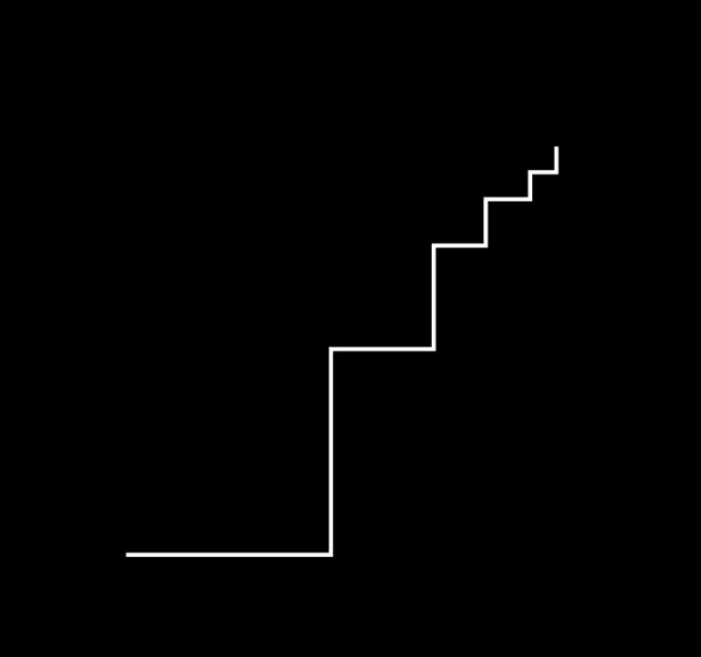
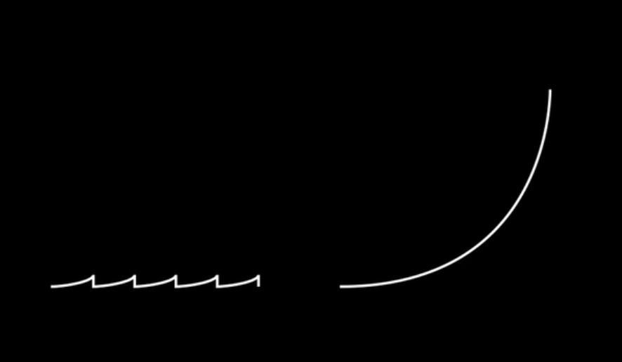

# Never Give Up

以前書いた時から、EVM について理解できてきているので、当時は読みづらかった技術系の文章もすらすら読めるようになりました。そこで頑張っているあなたももしかして読めずに悩んでいるのかもしれません。僕もそうだったので、安心してください。そのうち理解できるようになるだろう。

ちなみに、こちらの画像をみてごらん。

本当に経験した人しかわからないと思いますし、経験したとしてももう一度経験すると、やはり信じられない気持ちになると思うよね。続けることが一番大切だ。

-   遅くてもいい

-   理想と現実

-   「続けてても意味ない」

-   最初の第一歩が一番むずいけどね

-   三日坊主 VS 続ける

---

今回は、メモリーについて説明する。

Part 1 では、EVM がどのようにバイトコードのどこを狙って run させるかを見てきた。 それは、外部の calldata を入力してきてコントラクトのどの関数を呼んでいるかを判別して run すべきバイトコードの箇所を決めていることがわかった。

これを理解することで、関数の署名・call stack・calldata・EVM のオペコード について理解が進んだと思う。

Part 2 では、EVM におけるメモリーについて色々見ていこう。

## Reference

[EVM Deep Dives: The Path to Shadowy Super Coder 🥷 💻 - Part 2](https://noxx.substack.com/p/evm-deep-dives-the-path-to-shadowy-d6b?s=r)
