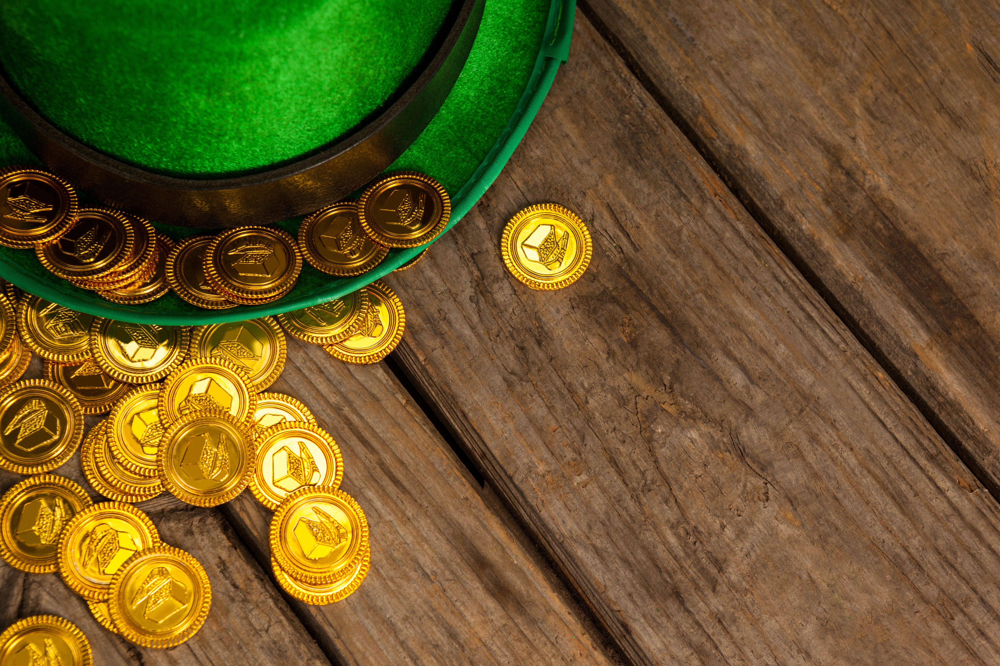
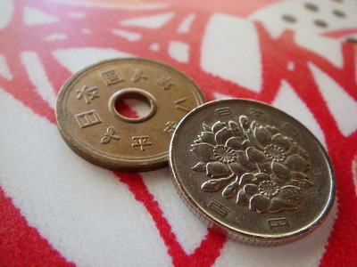
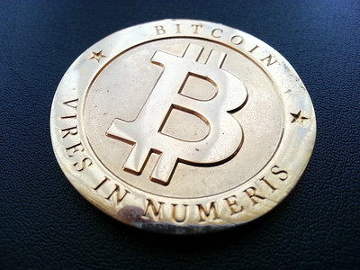

# Scarcity

あなたは、「希少性がある」「希少性が無い」ということを考えたことがありますか？

「希少性」とは何でしょう？

「希少性」は、欲求に対して量や数が極めて少ない、ある意味客観的事実です。

また、そのために生じる価値のことを「希少価値」といいます。

普段の生活においては我々は実は無意識のうちに価値の判断を毎日しています。「これは私にとって価値がある」、「それは価値がない」などと色々考えて行動をして、人間の一つ一つの小さな行動パターンが市場を決めているのです。しかし、我々の感覚的な価値の判断は実は少し立ち戻って考えると、多少ずれた感覚であり、あまりにも短視的に物事を見ていることがわかると思います。

今回は希少性の話をしたいと思います。結論をいきなり言ってしまうとすごく疑問に思うかもしれませんので、ゆっくり話を読んでもらえれば、私の主張が当たり前のように思えてくるでしょう。

## 希少性を考える

世の中で何に希少性があるかということはよくよく考えてください。もちろん、代替できないものが一番希少性があるでしょう。その最たるものはあなたの命です。それは自分自身にとってはかけがえのない価値を持っているのは自明です。しかし、よく考えるとそれは赤の他人にとってどれくらいの価値があるのか？あまりないのかもしれませんし、結構ある場合もあるでしょう。

こういう主観によって価値が変わるものが世の中には存在します。例えば画家による絵画がそうです。ブロックチェーンの世界でいうと NFT に相当します。人によってはものすごい価値を持つし、価値がゼロの場合もあるでしょう。

しかし、今回議論したいのはこういう類のものではなく、普遍的に皆さんにとって価値があり、尚且つ交換しやすいものの希少性を考えてほしいのです。

まず言っておきたいことがあります。前提として、もしあなたが崇拝している資産があれば、その考えを捨ててほしいです。先入観なしで平等に客観的に判断をして初めて希少性について気付くことができると思います。

物事の値段というのは伝統的な経済の理論の中で需要と供給のバランスで決まるという前提があり、希少性と不可分です。希少価値があるか否かの判断基準としては、需要があまり減らず、供給もあまり増えないことだと考えています。希少価値があるものは高価格である、あるいは将来的に高価格になりうるものと言えます。

それでは、希少性のあるものについて一個ずつ考えましょう。

## Japanese Yen

価値というものについて考えた時に一番最初に思い浮かぶものは日本円でしょう。しかし、日本円は果たしてどれくらい希少性があるのか。

日本円は政府の信頼に基づいて発行されており、政府は信頼されてきちんと円の希少性を担保してくれると信じている方が少なくありませんが、実際には未だに日本円は続々と刷られて市場へ放出されています。これがいわゆる普段耳にする「金融緩和」という言葉です。シンプルにいうとお金を大量に刷っているのです。

こんなものに希少性があるのか甚だ疑問です。

## Real Estate

不動産というのは、大衆的に特に中国あるいは昔の日本のような急成長した国では神話のような資産として語られがちです。そういう国では、永遠に価値が上がるものとして見られてきました。何十年も事実として成り立っているものは神話となってしまいます。それもいずれ終焉を迎えるのです。

不動産を需要と供給のバランスの観点から話すと、決して希少性のある資産ではありません。なぜなら、まず需要は人口や景気に比例し、供給は不動産の開発規模に依存するからです。基本的に不動産開発の規模は、もし需要が増えれば増加させることで価格のバランスを取ることができます。

不動産開発の規模はある程度までは無限に増長できます。極端な話ですが、地球上に土地がなくなっても宇宙開発をする人間社会は、例えば火星へ引っ越しして不動産開発をすれば、供給は一気に増えるでしょう。ましてや現在の人間社会はリアル世界からバーチャル世界へ進んでいることから、不動産に代表されるリアル世界の経済規模というのは長期的に見ると、どこまでも無限に増長可能なバーチャル世界と比較して、伸びしろが縮小する傾向にあります。

少なくとも不動産にはあまり希少性がありません。

## Stocks

株は会社が発行しているものです。いくらでも再発行や追加発行でき、しかも倒産のリスクもあります。当然ですが、あまり希少性はありません。

## GOLD

続いては歴史が長いゴールドについて話をします。

こういう貴金属には希少性があると思うでしょう。ゴールドは長い歴史の中で供給もあまり増えず、なかなかレアなものであり、お金として見られてきたので、たしかに希少性があるように思えてしまいます。

しかし、需要と供給の話をすると、需要は長い歴史の中で形成されてきたのであるのは間違いありません。ですが供給側でいうと、自然な鉱物だとすると、鉱山をいっぱい発見すれば供給がそれだけ増えてしまいます。

一方でもし需要がたくさんある場合、鉱山を見つけるためのインセンティブが働いてたくさん鉱山が見つかるでしょう。また、さらに宇宙進出をしている人間が宇宙でたくさんのゴールドを手に入れたら、ゴールドの希少性にまつわる神話も終わりを告げるでしょう。

一定条件のもとでは、ゴールドは希少性がありますが、長期的に考えるとあまり希少性はありません。

ゴールドでさえも希少性があまりないというなら、何に希少性があるんだよと思うかもしれないです。

ではここで重要な結論を話します。ブロックチェーンの元祖であるビットコインです。

ここでいうのは代表格の Bitcoin を言っていますが、別にその他のアルトコインに希少性が無いという意味ではないと理解してください。

## Bitcoin

ビットコインはハードキャップ(上限となる発行量)である 2100 万個という人類社会のコンセンサスがあることから、人工的に作ったあまり変えられない数の供給が成り立っています。これは１国家だろうがだれであろうが、このハードキャップに対するコンセンサスを動かすのは結構なハードルがあります。

また、需要面からいうと、ブロックチェーンのリテラシーが増加の一途をたどっており、今やWeb3は日本の国家戦略とかになったりしていて、そのインフラであることからますます多くの人々がブロックチェーンへの理解ができるようになるでしょう。また、人間社会がリアル世界からバーチャル世界へいくのは目に見えているし、現実世界の価値のアンカー(基礎)はゴールドだとすると、バーチャル世界の価値のアンカーはほぼビットコイン一択です。需要が増えることも間違いないでしょう。

したがって、筆者はこれまで色々見てきた普遍的な価値を持つものの中で、bitcoin のような人工的なものだけが長期に渡って絶対的な希少性が成立します。

## PS

正直、希少性のある普遍的なものというのはあまりありません。どんな物質であろうが頑張れば手に入るか、あるいは量を増やせると思います。今までのインターネットにおいてはデータはコピーできるというチート技を使えば希少性はありませんでした。

### _免責事項_

_本 website にかかれている内容はあくまで個人的な見解であり、Financial advice ではありません。_
