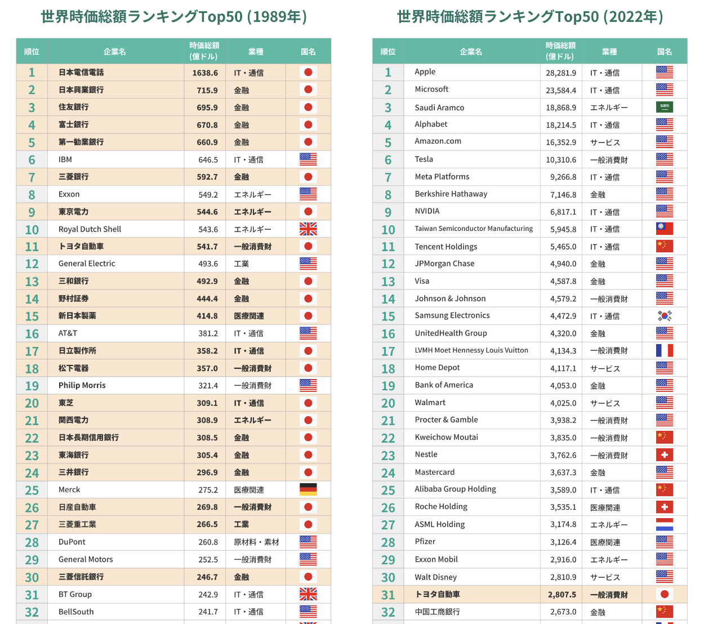
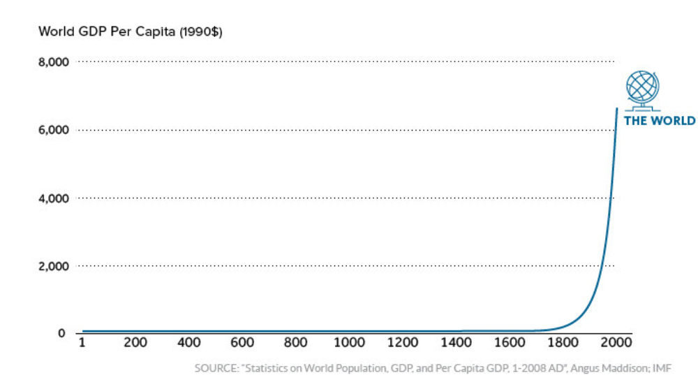

# Why Crypto is the Future

## Crypto is the future

結論から言います。ぼくはクリプトが未来だと考えています。

その理由を語るには、結構な労力と時間が必要なのかもしれませんが、言語化することによって、自分の頭の整理にもなるので、ここで私はそれに挑戦したいと思います。

少し想像してみてくださいね。

> 現実世界のどんなものでも（サービス、不動産、債権、キャッシュ、ドリンク、ホテルのいち日泊まる権利、などなど）、また、バーチャル世界にあるどんなものでも（ゲームアイテム、音楽、バーチャル世界の土地、ゲームキャラのスキンなどなど）、インターネット上でボーダレスにミドルマンなしで、取引ができる時代

これが私が考えたブロックチェーンの近未来です。もちろん、様々な壁やハードルが立ちはだかっているのは間違いないです。けれど、それが何年かかるかわかりませんが、近いうちそれに近い形態になると思います。なぜなら、そういったインフラはすでにできてきて改善もどんどんされていっている時代なので、そうなっていくのは目に見えたからです。

また、自分が考えた世界に比べて実際にはもっと進んでいる可能性が結構高いと思います。なぜかというと、人間は線形的に物事を考えがちであり、今の状況がよりよい状況になるという想像しかできません。実際には今では考えたことのない状況になったりするのもあり得ます。自分が想像力に欠けるのも無理はありません。ただ、現時点に基づいて予測をしないと何も始まりませんよね。

結果を言ったのはいいけど、なんでだと思うと思いますので、ここから述べていきます。言いたいことが山程あるので、記事はシリーズ化します。

## リアルからバーチャルへ

大きな理由としては、人間社会はリアルからバーチャルへ遷移していることが大きな理由です。

### Metaverse

最近だと、メタバースというワードがかなり耳に入ってくる様になったのではないでしょうか。メタバースと聞くと、わけがわからないのかもしれませんが、自分理解ですと、このワードはまだ意味が定まっていないと思います。あえて意見を言わせてもらうと、メタバースはいわゆるバーチャル世界そのものの定義になります。誰でも作れますし、すでにあるインターネットそのものも広義的にメタバースなのです。

例えば、すでに私達のグーグルアカウントあるいはイーサリアムウォレットのアカウントとかがメタバースの私達の分身と理解してもよいでしょう。ただ、このメタバースはまだまだ初歩的な段階なので、本当に使えるバーチャル世界と言えるのかというところが確かにあります。

### "Software is eating the world"

英語圏ではとても有名な言葉があります。それはこの「Software is eating the world. (ソフトウェアは世界を飲み込んでいる)」という言葉です。

これは 2011 年に A16Z というとても先進的な視野を持つ[ VC のファンダーが話した言葉](https://a16z.com/2011/08/20/why-software-is-eating-the-world/)です。その後の世界はご存知の通り、彼が言った通りになり、ソフトウェアは世界を飲み込んでいきました。

### Companies' market cap ranking

上の画像でわかるように、その過程では世界時価総額ランキングの上位はほとんどインターネット企業、いわゆる FANG または GAFA と呼ばれる企業に独占されるようになりました。

一昔日本企業があれだけ独占していたランキングですが、日本がインターネットの波に完全に逃したせいで、今やランキングの下位となっています。アメリカの企業がほとんどで、たまに中国や韓国の企業が現れて、31 位になって初めてトヨタが出てきています。世の中の時流はものづくり時代からインターネット時代になったということです。

こういった企業のサービスを使ったことがある方はわかると思いますが、とても役に立っていて、一度使うとなかなかそのエコシステムから抜け出せなくなります。このように、ソフトウェアがこのように世界を飲み込んでいます。しかし、これでは終わらないのです。

これは見方を変えると、人類がバーチャル世界へ進んだ第一歩に過ぎず、まだまだ道のりは長いです。現在こういった大企業が作っている初歩的な「メタバース」の世界はこれでインフォメーションをデジタル化することに成功していて、まだお金というものは現実世界から切り離した形でデジタル化できていません。（例えば paypay とかはお金と同等なように思われますが、独立した形でお金というものではなく、結局は日本円の分身であり、paypay の運用会社に大きく依存した形です → 運用会社はその世界の神様です）

### 神様のいない（非中央集権的な）世界

ブロックチェーンはこれを解決してくれます。ブロックチェーンは今のインターネットにおけるなんでもコピーできてしまう問題を解決し、バーチャルなものにリアル世界と同じような誰にも関与されない希少性、抗改ざん性を与えて、初めてバーチャル世界を「世界」として成り立たせることができるのです。先程、神様といったのは例えばあなたの生きる世界に神様がどこかの人間になると、怖くありませんか。その人の決定で何もかも変わる可能性があります。極端な話、生存の権利さえも奪われるリスクが潜んでいます。そんな世界ってディストピアで嫌ですよね。

すでに気づいてるかと思いますが、今私達はまさにこの神様がいる（中央集権的な）インターネット世界に住んでいます。youtuber さんはわけがなくチャンネル停止されるし、アマゾンでは明確な理由が与えられず出店停止処分になったりする。ツイッターだってトランプさんのアカウントがバンされたことで有名でしたね。

もちろん、悪さをしてバンされたらそれはそれで仕方ないのですが、ただ会社側の一任ですべてが決定されてしまうのは果たして正義なのかどうかは議論の余地があるのではないでしょうか？

実際にイーサリアムの創始者であるビタリック氏はワールドオブワークラフトの MMO ゲーム内の好きなキャラクタが弱体化されたことで嫌気が差したのがイーサリアムというブロックチェーンの始まりだとも言われています。神様のいない世界は人類史上なかったので、さぞかしビタリック氏は作りたかったんだろうね。

ブロックチェーンであれば、神様のいない世界が作れるという点が非常に大きいです。これによって万人平等で同じルールに則った世界が構築できる様になったといえます。

ただ、今はこの大きな課題解決の現在進行系であり、あれやこれの不具合や満足の行かない点がたくさんあるでしょう。

そういったときには、私の意見としては未来志向がいいです。未来志向は何かというと、クレーマーにならず暖かく見守ってあげて一緒に成長するのがベストだと思います。クレーマーになるのは簡単であり、課題を解決する側に回って色々考えて行動することこそ社会が進化していく力となっていくので、結局はみんなウィンウィンになるわけです。

話がそれましたが、人間社会はリアルからバーチャルへという大きな方向性は間違いがなく、すでに自分たちの活動はたくさんインターネットへ移植しています。これが加速していきます。

### Human society's GDP

_[出典](https://www.weforum.org/agenda/2017/09/over-2000-years-of-economic-history-in-one-chart)_

人類の歴史における 一人当たりの GDP は上のグラフを見て下さい。わかるかと思いますが、指数関数的に増加していることがわかります。これの主な要因には、一つとしてリアルな世界では資源のみ開発の部分がたくさんあったことと、技術的な進歩が爆発的に増加したと思います。産業革命以後、人類はパンドラのボックスを開いたように、知の集合体として大きく成長し、もはや産業革命のときみたいに一種の技術進歩で大きく人類が前進するという状況ではなくなっています。

今現在だけでも、自分の認識している範囲ですと、5G、ブロックチェーン、AI、Iot など、様々な技術が雨後の筍のように現れてきて、同時に進化して融合しつつ、次の産業革命として人類社会を爆発的に前進させるでしょう。想像を絶するような世界がまた 10 年 20 年後には現れて人間社会のこれまでの知識、経験、哲学や価値観をすべて考え直さなければならないのかもしれません。今はこれだけ進化の速度が早くて、毎日が新たな歴史のページをめくっているようなものです。

### Why human will go virtual

また、なぜバーチャルが良いのかという疑問もあろうかと思います。

昔マルクスの人口論でも有名ですが、人類の発展はいずれ現実世界の限界を迎えてしまい、減速してしまうでしょうという理論です。自分は人間社会の GDP はますます増加していくことは間違いないと思っています。なぜなら現実世界は制約がありますが、バーチャル空間は制約が少ないからです。

人間は大航海時代以来、影響範囲を拡大しようと、地球をたくさん探索し続け開発してきました。今や宇宙へ行こうとしています。ただ、宇宙開発はそう簡単にできるわけではありません。宇宙の開発を突破するには時間と空間というとてつもなく困難な壁がありました。そこで、この制限がかかっていないバーチャル空間の開発が容易なのではないかと普通は考えます。バーチャルな世界にいると、瞬間移動もできてスペースの問題も解決されます。

Web3 が来ると人類のバーチャル化が更に加速していきます。価値が容易にインターネット内でやり取りできるようになり、機械と機械がミドルマンなしで価値のやり取りができるようになります。少し予言しますが、将来はこの機械間の価値の交換がメインになるでしょう。いわゆるお金については、ますますプログラマブルマネー（コーディングで制御できるお金）になっていくわけです。

バーチャルな世界で生きている人間は当然バーチャル世界ネイティブな資産が生まれてもおかしくないでしょう。それがクリプト（仮想通貨）です。

## Why people cannot understand this trend?

この話はめちゃめちゃ重要で、なぜ気づいていない人々がおおいのでしょうか？という疑問を抱くと思います。これについては、まあいろいろな理由があるでしょう。でもこれを知ってもらったあなたにはこのトレンドのことを覚えてほしいです。

技術というものは歴史において毎回何かを一新して、既得権益者の利益に触れます。そうすると必ず反発を受けます。

だけど、短期的には既得権益のほうが勝つかもしれませんが、長期的には勝てません。時代のトレンドというのは逆らうことがほぼ不可能なのです。

英語ではよく言われる言葉として以下があります。

> First they ignore you, then they laugh at you, then they fight you, then you win.

これはクリプトの業界でもめちゃくちゃぴんとくる言葉です。「最初に彼らあなたを無視し、それからあざ笑わい、それから抗い、最終的にはあなたの勝利」というような感じで、歴史においては様々なトレンドがたどってきた運命なのです。

車の歴史もそうですし、発明された当初、めちゃくちゃ効率が悪くデザインも良くなかったので、馬車のほうが全然いいと思っていた人が少なからずいました。また、そのあとのインターネットも発明された当初は誰にも理解されず、ビル・ゲイツがテレビでインターネットを紹介していたときには観客と司会者の方から大いに笑われていました。今だから言えるのですが、当初のビル・ゲイツが想像した世界よりも遥かに進んだインターネット社会ができています。

そこで、今度はブロックチェーンの番です。「ディスられる、怒られる、軽蔑される、無視される、それでも進化し続けて社会を変えていき、我々の生き方も変えてくれる」、これがクリプトです。

だらだらと書いてしまいましたが、普段友人に聞かれて説明すると結構な時間をかけて説明できたりしますが、いざ書くとなるとうまくかけないんですね。まだ書ききれないほどありますので、また次回をお楽しみに！

### _免責事項_

_本 website にかかれている内容はあくまで個人的な見解であり、Financial advice ではありません。_
