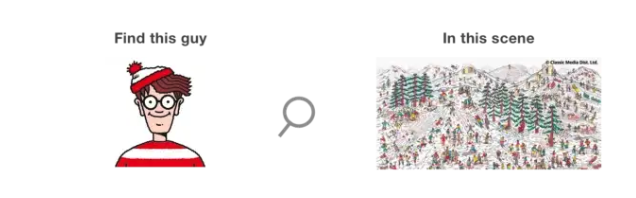

ゼロ知識証明はシンプルに言うと人に秘密をバラすことなく、知っていることを証明できること。

妙な言い方をしていて、自分もなかなかとっつきにくいことだと思いました。事例を通して理解すると、ピンとくることもあるのかもしれない。

ゼロ知識証明は非常に重要で、これを使うことで、プライバシーの妥協をすることなく、なにかをすることができる。

-   ウェブサイトへログイン：パスワードを入力するかわりに、自分がそれを知っていることを証明すればよい
-   アイデンティティの認証：本名をバラすかわりに、プルーフを送るだけで済む
-   プライベートブロックチェーンのトランザクション：お金をパブリックなビットコインブロックチェーン上で送るよりも、プルーフで検証することで済む。例えば、Zcash はこの仕組である。

## 例１

Alice and Bob は絵本にいる Waldo の場所を探すのに競っているとしよう。

Alice は Waldo の居場所は見つかったと言い張っている。
Alice は実際の居場所をバラすことなく、伝えたくて色々考えた。

### Proof1

Alice は Waldo の破片をそのまま切り取って Bob に見せる。Bob は Alice の切り取った破片、あるいは切り取った後の絵本を参考に答えを探すことができる。

### Proof2

Alice は別の紙を絵本にかぶせて、Bob に Waldo だけ穴を開けてを見せるとしよう。この場合、Waldo が周りの正確な風景にいるかは不明で、Alice はその風景を正しく証明できれば証明できる。

### 健全性、完全性、ゼロ知識の属性

この二種類のソリューションはゼロ知識証明の３つの属性である健全性、完全性、ゼロ知識を満たしていると言えよう。

1. 健全性：証明できたら、本当になる。Alice がもし Waldo の居場所を探せなかったら、ランダムなピースになったに違いなく、すぐに見つかっていないとばれるだろう。
2. 完全性：証明できた場合は必ずプルーフがある。Waldo を探せた場合、必ず Waldo を見せなければならない。
3. ゼロ知識：証明されたことが見せられていて、事実そのものは見せていない。唯一見せた事実は Waldo は見つかったよということだけで、どの場所にいるかとかの情報は開示していない。

## 例 2

もう一つ例を見てみよう。Alice は色盲で、Bob はそうではない。でも Alice は Bob が自分は色盲でないことを信用できておらず、Bob に証明してほしいと思っている。

そこで暗号専門家の彼女はうまく考えて実験をしだした。

Alice は青いボールとレッドのボールを持っていて、体の後ろにもっていき、シャッフルしてから Bob に見せつつ、ボールが入っている手が変わったのかについて尋ねる。
これを 20 回くらい繰り返すことで、もし Bob が全部正解していたら、たまたま Bob が色盲でありつつ、正解できた確率は 1/1048576 くらいで無視できるので、ほぼ信頼に値するだろうと Alice は考えた。

**THE END**

[0xSage さんの記事](https://medium.com/good-audience/understanding-zero-knowledge-proofs-through-simple-examples-df673f796d99)を参考に抜粋・翻訳したりしている。
