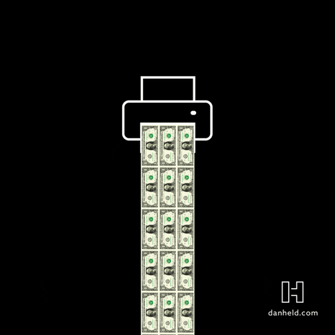
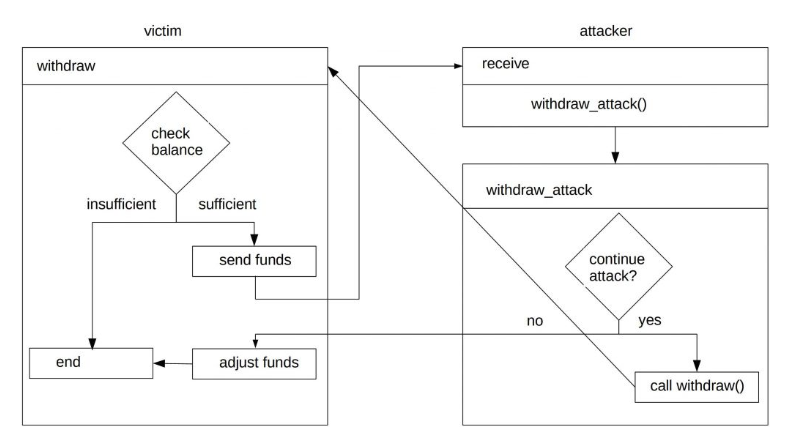

EVM のインタラクションについては、外部のコントラクトを呼び出すときに、主導権は全部外部のコントラクトが握ることとなり、危険がケースがある。もしその外部のコントラクトは悪意のあるコントラクトの場合、悪用されるリスクにさらされる。



EVM(Ethereum Virtual Machine) の世界では、Re-entrancy の攻撃というのがある。

まさにこの攻撃手法が取られることがある。

攻撃のコントラクトはコントラクトに何度も入り込んで、チェックする条件が反映される前になんども同じ操作をされてしまうというやり口である。本来なら一度のみ呼ばれるものが何度もチェックを抜けて呼ばれると予期しない挙動になったりして、資産が盗まれたりする。

この攻撃手法は昔の [The DAO 事件](https://www.gemini.com/cryptopedia/the-dao-hack-makerdao)がやられた手法でもある。歴史に残る大事件だ。

他のソフトウェア環境では起こらないよう脆弱性だ。これは新しい開発者だとやりがちなミスになる。

このような状況において、Checks-Effects-Interactions を適用してください。

-   外部のコントラクトを呼び出すのは避けられない
-   Re-entrancy 攻撃を避けたい

## 実装

-   まず、check

関数を呼び出してまず実行する条件をチェック（例えば十分な資金をもっているか）。

-   次、effect

その次にすべての状態変数を更新すべき

-   最後、interaction

最後に外部のコントラクトとのインタラクションをすべき。内部の状態が完全に更新された後に、初めて外部のコントラクトを呼び出す。

この順番さえ守れば、Re-entrancy 攻撃は最初の関門をくぐりぬけれなくなります。

もし、最後に状態の変更をするとなると、状態変更される前に何回も同じ関数の部分が呼び出されてしまい、Re-entrancy 攻撃の罠にハマってしまう。

## 実例

```sol
pragma solidity 0.8.13;


contract reentrancyVictim{
    mapping(address => uint256) public balances;
    uint256 public contractBalance;

    function payIn() public payable{
        balances[msg.sender] += msg.value;
    }

    function withdraw() public payable{
        require(balances[msg.sender] > 0, "Insufficiant balance");
        payable(msg.sender).call{value: balances[msg.sender]}("");
        balances[msg.sender] = 0;
    }

    function updateContractBalance() public{
        contractBalance = address(this).balance;
    }
}

```

このコードは一見して大丈夫なように見えるが、`withdraw()`関数の 2 行目に十分な資産があるかを確認している。次にアセットをユーザーへ送付している。最後にバランスを更新している。

これは check-effect-interaction のルールを守っていない。

-   check: ` require(balances[msg.sender] > 0, "Insufficiant balance");`
-   interaction: `payable(msg.sender).call{value: balances[msg.sender]}("");`
-   effect: `balances[msg.sender] = 0;`

となっており、effect と interaction の順番が逆。

その結果、Re-entrancy 攻撃が可能となる。

具体的なスキームはこんなかんじ：



adjust funds の前に、何回も何回も資産が抜き出されて、最後に資金がそこをつくことになるだろう。

Attacker のコードは以下：

```sol
pragma solidity 0.8.13;


contract reentrancyAttack{

    address public victim;
    uint256 public amount;
    uint256 public counter;

    constructor(address _victim) payable{
        victim = _victim;
        amount = msg.value;
    }

    receive() external payable{ // イーサ受け取り用のreceive関数
        counter++;
        attack();
    }

    function payIn() public returns (bool success){
        (bool success, bytes memory data) = payable(victim).call{value: amount}(abi.encodeWithSignature("payIn()"));
    }

    function withdrawAttack() public{
        if(counter < 4){
            // もう一度withdrawを呼ぶ用
            payable(victim).call(abi.encodeWithSignature("withdraw()"));
        }
    }
}
```

### ソリューション

その対策としては、実はものすごくシンプルに`withdraw()`の第 3, 4 行を逆転させて、修正を加える。

```sol
 function withdraw() public payable{
    // check
    require(balances[msg.sender] > 0, "Insufficiant balance");
    // effect
    uint256 payBalance = balances[msg.sender];
    balances[msg.sender] = 0;
    // interaction
    (bool success, bytes memory data) = payable(msg.sender).call{value: payBalance}("");
        if(!success){ // catch the case where the send was unsuccesful
            balances[msg.sender] = payBalance;
        }
}
```

もし、success が false の場合、バランスを元通りに戻す操作をしている。
// interaction の行において reenter されても、すでにバランスはゼロなので、revert され、問題はなくなった。

**THE END**
