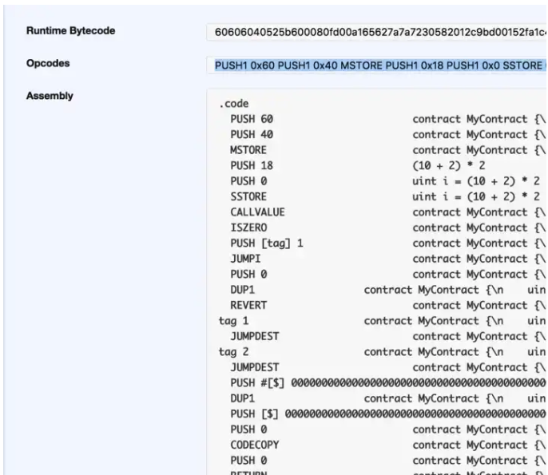

ここでは、opcode（オペレーションコード）について語るには EVM についても語る必要がある。

他のプログラミング言語と同じように、solidity はハイレベルなプログラミング言語であり、人間が読みやすい一方で、コンピューターは理解できない。私達が geth をインストールすると、それに加えて Ethereum Virtual Machine がつきものとしてついてくる。EVM とは軽量級の OS みたいなもので、スマートコントラクトをランする環境として用意されている。

Solidity のコードを solc コンパイラを使って compile するときに、コードをバイトコードに変換される。EVM はバイトコードが理解できる。

下記のスマートコントラクトの例を見てみよう。

```sol
pragma solidity ^0.4.11;
contract MyContract {
    uint i = (10 + 2) * 2;
}
```

この場合、remix browser で走らせた場合、コントラクトの details を見てみてください。そうすると、以下の情報が見えてくる。


このケースでは、コンパイルされたコードは：

```
60606040525b600080fd00a165627a7a7230582012c9bd00152fa1c480f6827f81515bb19c3e63bf7ed9ffbb5fda0265983ac7980029
```

このデータはヘクサデシマルデータとして現れ、コントラクトの最終の形となっている。バイトコードと呼ばれているものだ。

実際にコントラクトをデプロイするときには、このバイトコードをデプロイしていることとイコール。

ウォレットあるいはアドレスの前にある"0x"とは何を意味するのだろうか。"0x"からスタートするものはこれは EVM と会話をするには、EVM はどんなデータでも 16 進数のデータとして扱うのがデフォルトだからである。

そして、opecode もある。

```
PUSH1 0x60 PUSH1 0x40 MSTORE PUSH1 0x18 PUSH1 0x0 SSTORE CALLVALUE ISZERO PUSH1 0x13 JUMPI PUSH1 0x0 DUP1 REVERT JUMPDEST JUMPDEST PUSH1 0x36 DUP1 PUSH1 0x21 PUSH1 0x0 CODECOPY PUSH1 0x0 RETURN STOP PUSH1 0x60 PUSH1 0x40 MSTORE JUMPDEST PUSH1 0x0 DUP1 REVERT STOP LOG1 PUSH6 0x627A7A723058 KECCAK256 SLT 0xc9 0xbd STOP ISZERO 0x2f LOG1 0xc4 DUP1 0xf6 DUP3 PUSH32
```

opcode の情報については、[yellow paper](http://gavwood.com/paper.pdf) に書かれている。

EVM はスタックマシンである。

簡単に理解するために、以下を参考にしてください。

まずこのルールは伝統的なパソコンの [LIFO](https://techterms.com/definition/filo) と同じである。

通常の計算の場合：

```
10 + 2 * 2
// 答えは14

```

```
// stack machineの場合
2 2 * 10 +
```

上記はスタックマシンの場合で、まず２をいれて次の２を入れて、次に乗法記号の\*をいれて、計算し 4 になり、次に 10、最後にプラス記号で加法計算して、14 になる。

これで 14 の結果になる。

スタックに入れる命令は`PUSH`といい、スタックから除外する命令は`POP`という。一番良く見るパターンとしては、`PUSH1`があり、それは 1byte のデータをスタックにいれる

```
PUSH1 0x60
```

これは 1byte のデータとして`0x60`をスタックに入れることを意味する。そして、`PUSH1`の 16 進数表示は偶然に`0x60`と同じ。ここで、0x を除外すると、`6060`になる。

```
PUSH1 0x60 PUSH1 0x40 MSTORE
```

MSTORE は２つの入力が求められ、output なし。なので、上記の解釈をすると、

1. PUSH1(0x60): put 0x60 in the stack
2. PUSH1(0x40): put 0x40 in the stack
3. MSTORE(0x52): allocate 0x60 of memory space and move to the 0x40 position

実はいつも同じようなマジックナンバー`6060604052`を見るのは、solidity bytecode の誘導の始まりだからだ。

また、実は 16 進数ということは、10 進数で考えると、40 は 64 で 60 は 96 になっている。

“PUSH1 0x60 PUSH1 0x40 MSTORE”がやっているのは、96bytes のメモリーを allocate し、ポインターを 64 個目のバイトの開始位置に移動することになる。

これで、64byte のスクラッチスペースと 32byte の一時的なメモリを確保することができた。

EVM において、3 種類のデータ保存領域がある。

-   今紹介したスタックにある場所
-   RAM のメモリー領域で、MSTORE の opecode のところ
-   SSTORE の永久保存領域（とてもガス代がかかる）

そして、Assembly Language を使って、スマートコントラクトをかける。これによって opcode を使うことができる。結構難しいけど、有用なときもある。solidity のみではできないようなこともできてしまう。

**THE END**

[Bernard さんの記事](https://medium.com/@blockchain101/solidity-bytecode-and-opcode-basics-672e9b1a88c2)を参考に抜粋・翻訳したりしている。
