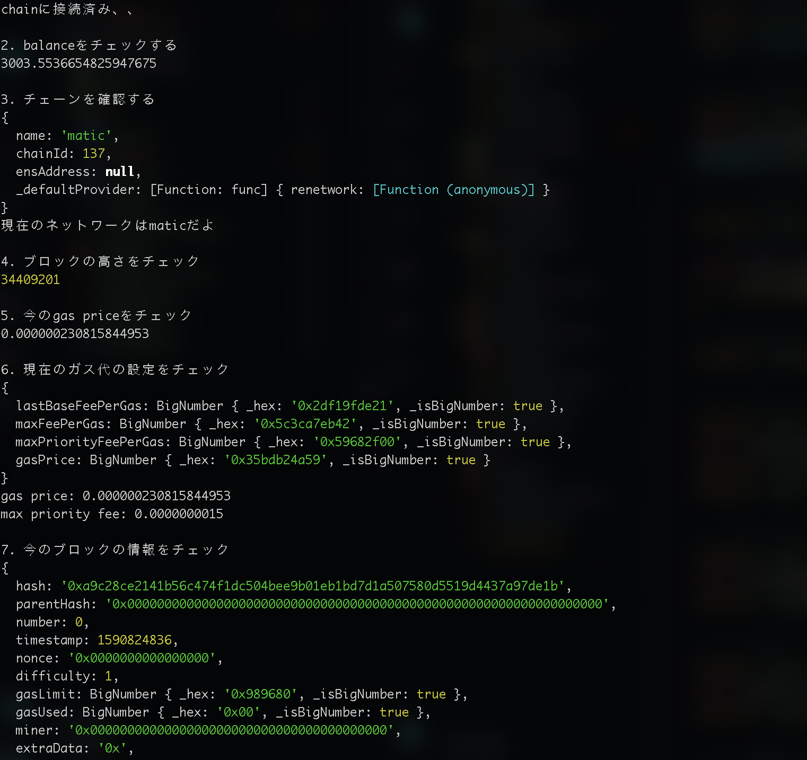

最近のポリゴンのガス代が半端なく高くて、使い物にならないなと嘆いていたりしています。正直、これでは Layer2 のほうが安いんですよね。そっちへシフトしていくのかなって考えている Thurendous です。

# Provider

今回は provider クラスについて紹介します。それを使ってオンチェーンの情報をとってみましょう。

## What is provider

provider とはイーサリアムネットワークにおける抽象的なクラス。標準的なイーサリアムノードにシンプルで一貫性のあるインターフェースを提供している。

ethersjs にある provider はプライベートキーと関係がなく使えます。読み込みだけだと、書き込みはできない。この点に関しては web3js よりはセキュリティが優れていると言えます。

## jsonRpcProvider

まずはノードプロバイダーのウェブサイトへ行って API Key を取得する必要があります。
おすすめしたいのは、Infura や Alchemy のほうなので、申請をして  API Key をゲットしてください。

ゲットしたら.env ファイルに以下のように記載してください。

```
polygon_url="https://polygon-mainnet.g.alchemy.com/v2/{あなたのキーを入れて}"
```

今回は dotenv も使うので、インストールをお願いします。

```shell
$ npm install dotenv --save
# あるいは
$ yarn add dotenv
```

そこからオンチェーンから情報をとってみましょう。(comment において色々情報を書いていますので読んでみて理解してくださいね。なんかあったら github の discussion か issue にてお聞きください。)

それでは、次回をお楽しみに！！じゃね

Have a nice weekend!!

```javascript
import * as dotenv from 'dotenv' // see https://github.com/motdotla/dotenv#how-do-i-use-dotenv-with-import
dotenv.config()
import ethers from 'ethers'

// 1. とあるnetworkに接続、今回はpolygon
console.log(`chainに接続済み、、`)
const provider = new ethers.providers.JsonRpcProvider(process.env.polygon_url)
// polygon_urlはあなた自身のあドレスにしてね

// 2. とあるアカウントのbalanceをチェックする
console.log('\n2. balanceをチェックする')
// とあるアドレス
const balance = await provider.getBalance(
    '0xeC20607aa654D823DD01BEB8780a44863c57Ed07'
)
// bigNumberとして返されるので、ethersのutilsを使って変換
console.log(ethers.utils.formatEther(balance))

// 3. チェーンを確認する
console.log('\n3. チェーンを確認する')
const network = await provider.getNetwork()
console.log(network)
console.log(`現在のネットワークは${network.name}だよ`)

// 4.ブロックの高さをチェック
console.log('\n4. ブロックの高さをチェック')
const blockNumber = await provider.getBlockNumber()
console.log(blockNumber)

// 5. 今チェーンのgas priceをチェック
console.log('\n5. 今のgas priceをチェック')
const gasPrice = await provider.getGasPrice()
console.log(ethers.utils.formatEther(gasPrice))

// 6. 現在のガス代の設定をチェック
console.log('\n6. 現在のガス代の設定をチェック')
const feeData = await provider.getFeeData()
console.log(feeData)

// 見にくいのでわかりやすい10進数にした
console.log(
    `gas price: ${ethers.utils.formatEther(feeData.gasPrice.toString())}`
)
console.log(
    `max priority fee: ${ethers.utils.formatEther(
        feeData.maxPriorityFeePerGas.toString()
    )}`
)

// 7. ジェネシスのブロックの情報をチェック
console.log('\n7. ゼロ番のブロックの情報をチェック')
const block = await provider.getBlock(0)
console.log(block)

// 8. とあるコントラクトのバイトコードをみる
// 今回はJPYCのバイトコード
console.log('\n8. とあるコントラクトのバイトコードをみる')
let code = await provider.getCode('0x431D5dfF03120AFA4bDf332c61A6e1766eF37BDB')
console.log(`-----proxy----- `)
console.log(code)
code = await provider.getCode('0xf2fAb05F26Dc8da5A3F24D015FB043DB7a8751Cf')
console.log(`-----implementation----- `)
console.log(code)
```

最後に、こんな感じになれば、取れてるってことで OK ですよ。


