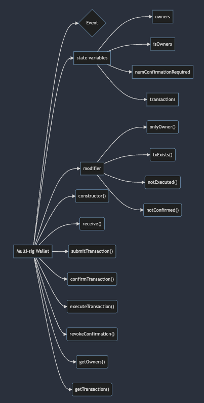

マルチシグウォレットを作る。

-   ウォレットの owner ができること：

    -   トランザクションを提出する
    -   トランザクションを許可あるいは却下
    -   マルチシグの owner がだれでもトランザクションの実行ができる

-   コントラクトの構造：

    

```sol
// SPDX-License-Identifier: MIT
pragma solidity ^0.8.13;

contract MultiSigWallet {
    // event関連
    event Deposit(address indexed sender, uint amount, uint balance);
    event SubmitTransaction(
        address indexed owner,
        uint indexed txIndex,
        address indexed to,
        uint value,
        bytes data
    );
    event ConfirmTransaction(address indexed owner, uint indexed txIndex);
    event RevokeConfirmation(address indexed owner, uint indexed txIndex);
    event ExecuteTransaction(address indexed owner, uint indexed txIndex);

    // owner配列
    address[] public owners;
    // ownerであるかを判断するmapping
    mapping(address => bool) public isOwner;
    // 必要な承認数、例：3人に2人の承認が必要な場合は2とする
    uint public numConfirmationsRequired;

    // 発行するトランザクションの情報
    struct Transaction {
        address to;
        uint value;
        bytes data;
        bool executed;
        uint numConfirmations;
    }

    // トランザクションのindex => owner => boolのmapping
    mapping(uint => mapping(address => bool)) public isConfirmed;

    // transactionによって構成された配列
    Transaction[] public transactions;

    // ownerに限定する
    modifier onlyOwner() {
        require(isOwner[msg.sender], "not owner");
        _;
    }

    // トランザクションが存在している
    modifier txExists(uint _txIndex) {
        require(_txIndex < transactions.length, "tx does not exist");
        _;
    }

    // まだ実行されていない
    modifier notExecuted(uint _txIndex) {
        require(!transactions[_txIndex].executed, "tx already executed");
        _;
    }

    // まだ承認されていない
    modifier notConfirmed(uint _txIndex) {
        require(!isConfirmed[_txIndex][msg.sender], "tx already confirmed");
        _;
    }

    // デプロイ時に実行されるもの
    constructor(address[] memory _owners, uint _numConfirmationsRequired) {
        require(_owners.length > 0, "owners required");
        require(
            _numConfirmationsRequired > 0 &&
                _numConfirmationsRequired <= _owners.length,
            "invalid number of required confirmations"
        );

        // 引数の_owners配列にあるownerをloopして、それぞれisOwnerをtrueにし、owners配列に突っ込む
        for (uint i = 0; i < _owners.length; i++) {
            address owner = _owners[i];

            require(owner != address(0), "invalid owner");
            require(!isOwner[owner], "owner not unique");

            isOwner[owner] = true;
            owners.push(owner);
        }

        numConfirmationsRequired = _numConfirmationsRequired;
    }

    // etherを受け取るため
    receive() external payable {
        emit Deposit(msg.sender, msg.value, address(this).balance);
    }

    // トランザクションを提案
    function submitTransaction(
        address _to,
        uint _value,
        bytes memory _data
    ) public onlyOwner {
        uint txIndex = transactions.length;

        transactions.push(
            Transaction({
                to: _to,
                value: _value,
                data: _data,
                executed: false,
                numConfirmations: 0
            })
        );

        emit SubmitTransaction(msg.sender, txIndex, _to, _value, _data);
    }

    // トランザクションを承認
    function confirmTransaction(uint _txIndex)
        public
        onlyOwner
        txExists(_txIndex)
        notExecuted(_txIndex)
        notConfirmed(_txIndex)
    {
        Transaction storage transaction = transactions[_txIndex];
        transaction.numConfirmations += 1;
        isConfirmed[_txIndex][msg.sender] = true;

        emit ConfirmTransaction(msg.sender, _txIndex);
    }

    // トランザクションを実行（ownerなら誰でもできる）
    function executeTransaction(uint _txIndex)
        public
        onlyOwner
        txExists(_txIndex)
        notExecuted(_txIndex)
    {
        Transaction storage transaction = transactions[_txIndex];

        require(
            transaction.numConfirmations >= numConfirmationsRequired,
            "cannot execute tx"
        );

        transaction.executed = true;

        (bool success, ) = transaction.to.call{value: transaction.value}(
            transaction.data
        );
        require(success, "tx failed");

        emit ExecuteTransaction(msg.sender, _txIndex);
    }

    // 自分がすでに承認したトランザクションの承認を取り消す
    function revokeConfirmation(uint _txIndex)
        public
        onlyOwner
        txExists(_txIndex)
        notExecuted(_txIndex)
    {
        Transaction storage transaction = transactions[_txIndex];

        require(isConfirmed[_txIndex][msg.sender], "tx not confirmed");

        transaction.numConfirmations -= 1;
        isConfirmed[_txIndex][msg.sender] = false;

        emit RevokeConfirmation(msg.sender, _txIndex);
    }

    // ownersを返す
    function getOwners() public view returns (address[] memory) {
        return owners;
    }

    // 履歴にあるトランザクション数を返す
    function getTransactionCount() public view returns (uint) {
        return transactions.length;
    }

    // トランザクションの中身を返す
    function getTransaction(uint _txIndex)
        public
        view
        returns (
            address to,
            uint value,
            bytes memory data,
            bool executed,
            uint numConfirmations
        )
    {
        Transaction storage transaction = transactions[_txIndex];

        return (
            transaction.to,
            transaction.value,
            transaction.data,
            transaction.executed,
            transaction.numConfirmations
        );
    }
}
```
